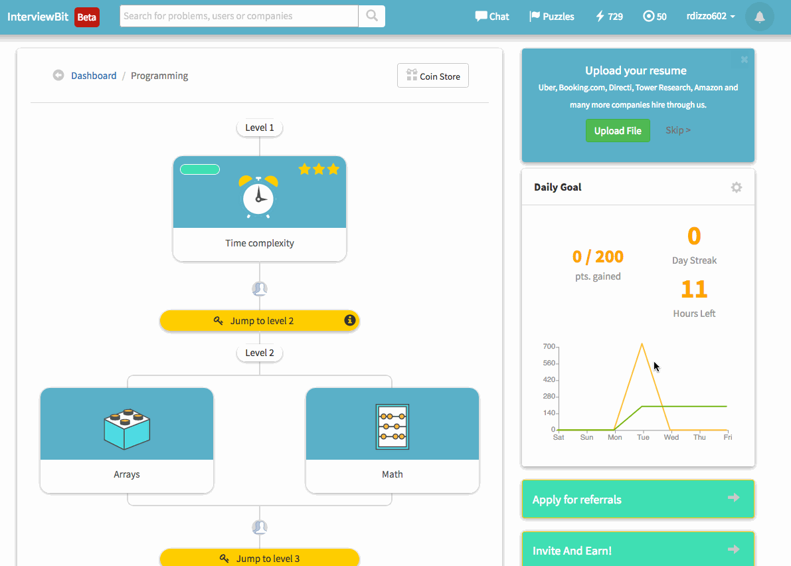

## CodePath Algorightms Prework

This is the git repository for pre-work submission to CodePath's Algorithm's course.

### Features

#### Required

- [x] Unlock checkpoints 1-5 on Interviewbit.
- [x] Publish code submissions for checkpoints 1-5 on Github.

### Walkthrough

###

